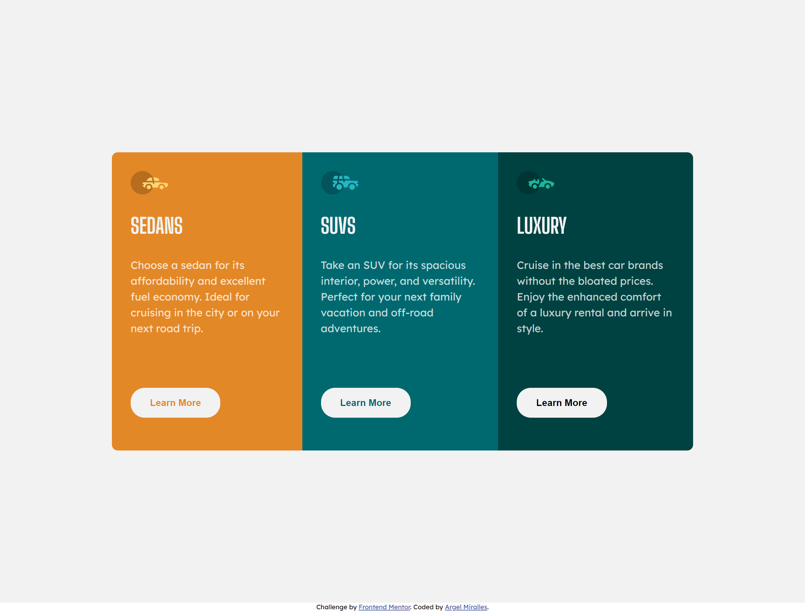

# Frontend Mentor - 3-column preview card component

Note: The photo above is the design preview for the challenge. The actual preview of my project can be seen below.

## Welcome! 👋

Thanks for checking out this front-end coding challenge.

This is a simple web application showcasing my command of HTML and CSS.

## The challenge

The main challenge here is laying out the cards in a three column design and make it responsive according to the user screen.

## My solution

I started building with the three main cards on top of each other, considering the mobile design first. Once everything is settled for the mobile screens, I then added media queries
and reorganized the cards horizontally, forming a one big card the contains the three smaller cards as its columns. From there, it was just a matter of scaling the size the main card
according to the size of the screen.

## Technologies used

HTML - Used to create the index.html file
CSS - Used to design the webpage
VSCode - IDE I used to create the web app
Git - For version control
Netflify - Used to host this web app

## Preview

![Actual preview for my project - Mobile]

## Deployment

You may visit the deployed web app through the link below.

- [https://amiralles-threecolumnchallenge.netlify.app/](https://amiralles-threecolumnchallenge.netlify.app/)

## Footer

Thank you for taking the time in checking out this repository.

**Argel Miralles | Full Stack Web Developer** 
**SIC PARVIS MAGNA**☝
